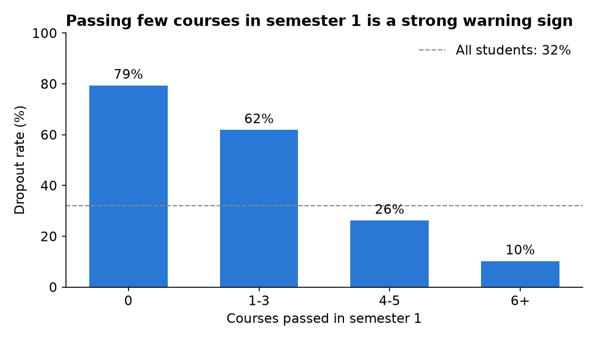
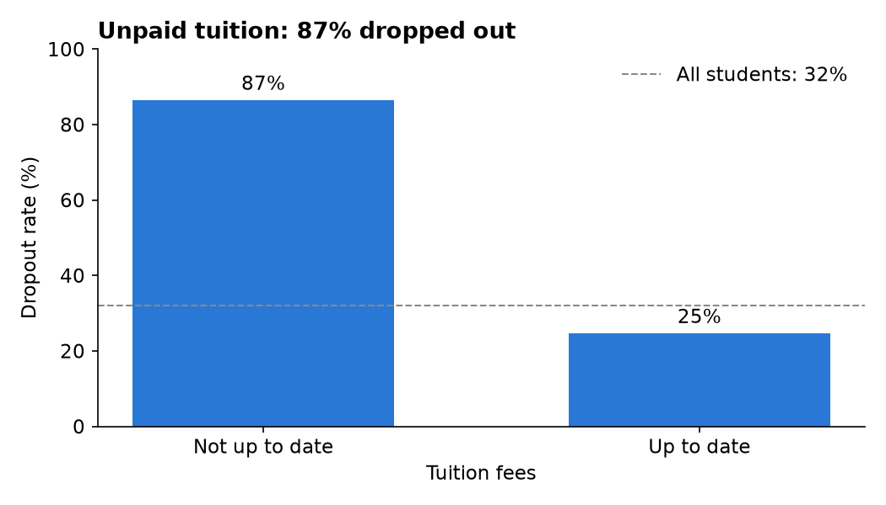
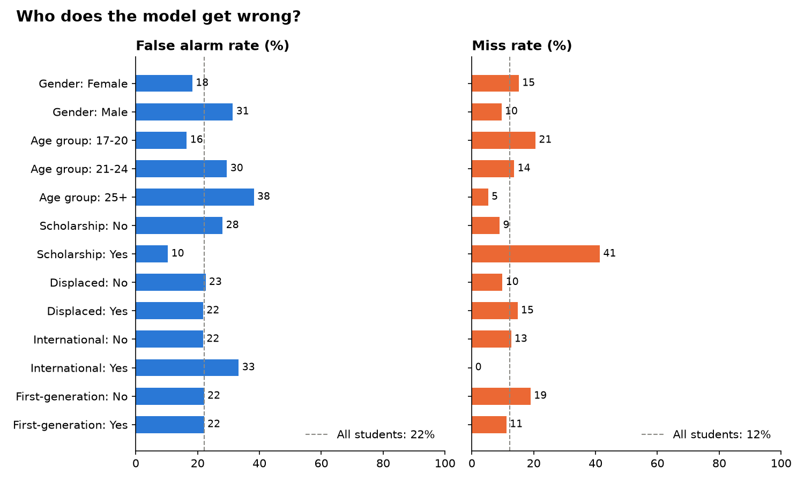
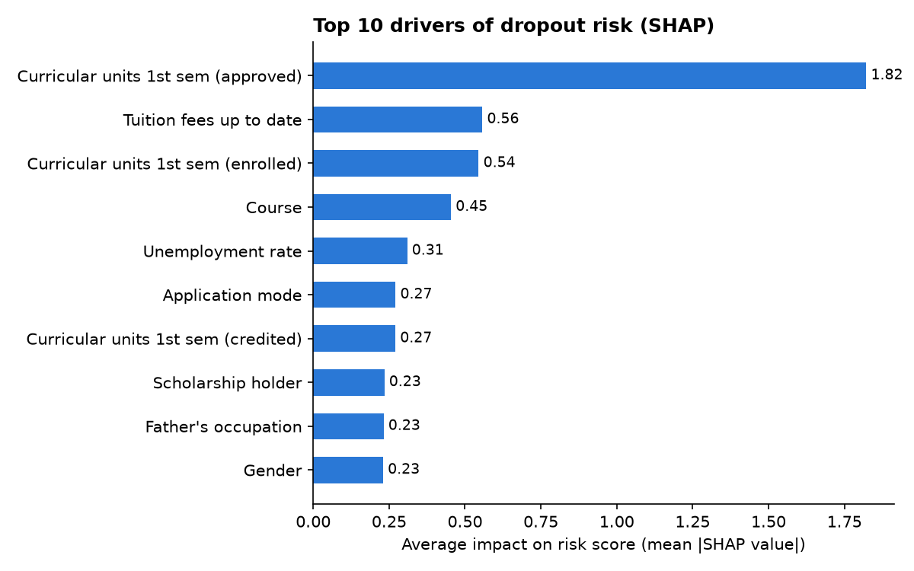
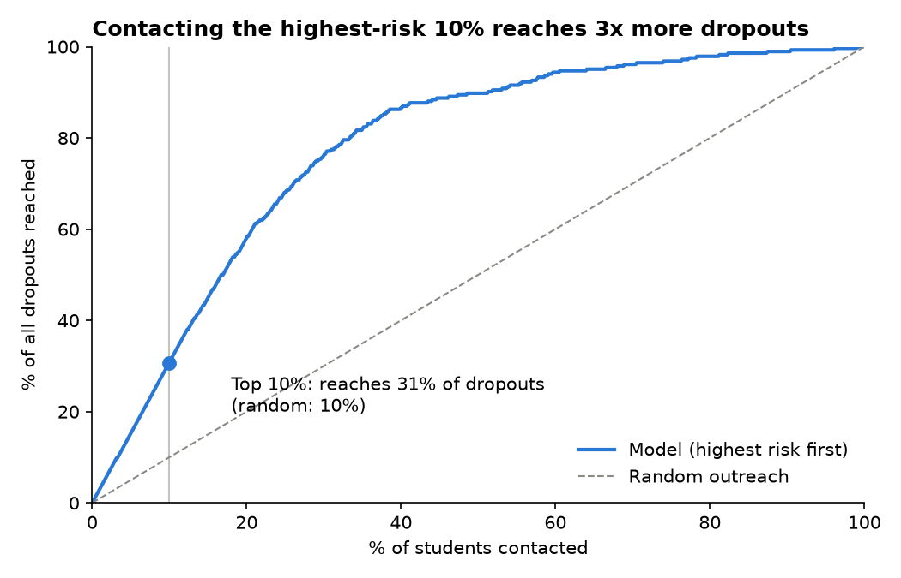
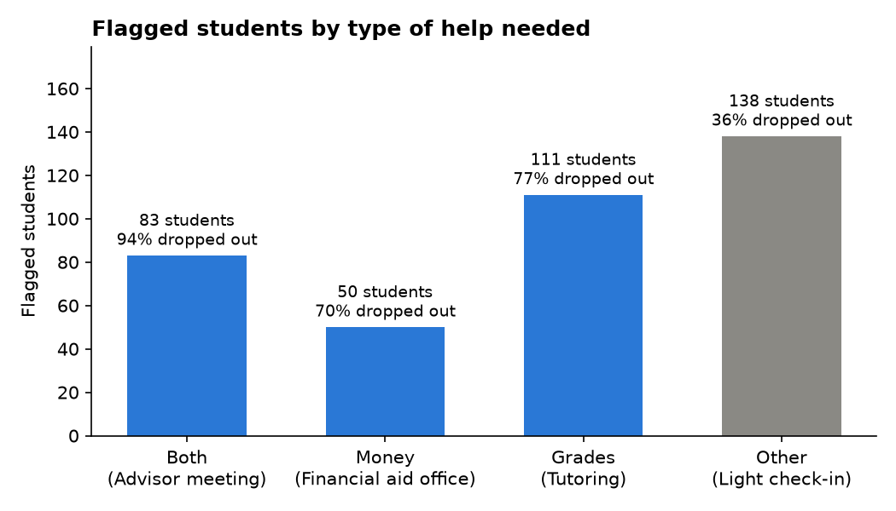

# Who Should a College Help First?

**A college advising office can only reach out to a limited number of students each semester. Who should they help first, and is the AI that decides fair?**

**Live app:** [student-dropout-risk-fairness.streamlit.app](https://student-dropout-risk-fairness.streamlit.app/) · **Notebooks:** [explore](notebooks/01_explore.ipynb) · [model](notebooks/02_model.ipynb) · [fairness](notebooks/03_fairness.ipynb) · [outreach](notebooks/04_outreach.ipynb) · [fairness fix](notebooks/05_fairness_fix.ipynb) · [more models](notebooks/06_more_models.ipynb)

## Key results
- **Top 10% works:** contacting the 88 highest-risk students (10% of the test set) reaches **31% of all dropouts, vs. 10% at random**. 87 of those 88 really dropped out.
- **Best model:** logistic regression after semester 1 catches **81% of dropouts** (ROC AUC 0.913) at the default cutoff, and **88%** at the cost-based cutoff of 0.35.
- **Different students need different help:** flagged students split into money trouble, grade trouble, or both, each matched to a different kind of support.
- **Not equally fair:** the model gives more false alarms to students 25+ (38% vs. 16.5% for ages 17-20) and misses 41% of scholarship holders who drop out.

## Why this matters
Advisors have limited time, so colleges increasingly use prediction tools to decide which students to contact. These tools can help, but they can also do harm. In 2023, The Markup found that Wisconsin's Dropout Early Warning System labeled many students "high risk" who went on to graduate, and its false alarms fell much more heavily on Black and Hispanic students.

This project builds a dropout risk model and then goes further. It turns predictions into an outreach plan (who to contact first and what kind of help they need) and audits whether the model treats some student groups unfairly.

## Data
[Predict Students' Dropout and Academic Success](https://archive.ics.uci.edu/dataset/697/predict+students+dropout+and+academic+success) from the UCI Machine Learning Repository: 4,424 students from a university in Portugal, 36 features (background, enrollment, finances, grades by semester, economy), and three outcomes. License: CC BY 4.0. See [data/README.md](data/README.md) for the data dictionary.

32% of students dropped out, 50% graduated, and 18% were still enrolled. The model predicts **dropout vs. not dropout**, like real early warning tools.

## Findings

### 1. Who drops out?
The strongest warning signs are early academic trouble and money trouble. Students who passed 0 courses in semester 1 dropped out at 79%, vs. 10% for those who passed 6 or more. Students with unpaid tuition dropped out at 87%, vs. 25% for those who were paid up. Scholarship holders dropped out at 12%, and students who started at 25 or older at over 50%.




### 2 and 3. How early can we tell, and which model works best?

| Stage | Model | Accuracy | Recall | Precision | ROC AUC |
|---|---|---|---|---|---|
| After semester 1 | Baseline (always "not dropout") | 0.679 | 0.000 | 0.000 | 0.500 |
| At enrollment | Logistic regression | 0.760 | 0.718 | 0.607 | 0.836 |
| At enrollment | Random forest | 0.757 | 0.701 | 0.605 | 0.824 |
| After semester 1 | **Logistic regression** | **0.860** | **0.806** | **0.768** | **0.913** |
| After semester 1 | Random forest | 0.837 | 0.782 | 0.730 | 0.900 |
| After semester 1 | Decision tree | 0.827 | 0.803 | 0.702 | 0.867 |
| After semester 1 | KNN (k=15) | 0.821 | 0.514 | 0.880 | 0.855 |
| After semester 1 | Neural network (Keras) | 0.855 | 0.739 | 0.795 | 0.907 |

- A Keras neural network didn't beat logistic regression, and its loss curve showed overfitting after about 10 epochs ([notebook 06](notebooks/06_more_models.ipynb)).

- The baseline shows why accuracy alone misleads: 68% accuracy while catching zero dropouts.
- Even at enrollment, the model ranks students fairly well (AUC 0.836), but with more false alarms. Semester 1 results are the biggest boost.
- The simpler logistic regression beat the random forest, and it's easier to explain to advisors.

### 4. Is it fair?

At the chosen cutoff, overall 22% of students who stayed were wrongly flagged (false alarms), and 12% of dropouts were missed. But errors are not spread evenly:



- **Over-flagged:** students 25+ (38% false alarm rate vs. 16.5% for 17-20) and men (31% vs. 18%).
- **Under-caught:** scholarship holders (41% of their dropouts missed vs. 9%) and students 17-20 (21% vs. 5%).
- **Similar:** first-generation and displaced students had similar error rates.
- **Why:** SHAP shows the model relies most on semester 1 courses passed and tuition, but it also uses gender and age directly.



**Fix tested:** removing gender, age, and 3 age-proxy columns cut the age false alarm gap from 21.7 to 13.4 points and the gender gap from 13.1 to 3.9, while catching 251 dropouts vs. 249. See [05_fairness_fix](notebooks/05_fairness_fix.ipynb).

### 5. Who should the college help first, and how?
Ranking students by risk makes a small outreach budget go much further than random outreach.



Flagged students are sorted by *why* they're at risk, using simple rules an advisor can check:

| Segment | Rule | Help | Flagged students | Dropped out |
|---|---|---|---|---|
| Both | Money and grade trouble | Advisor meeting | 83 | 94% |
| Money | Tuition not up to date or in debt | Financial aid office | 50 | 70% |
| Grades | Passed fewer than half of semester 1 courses | Tutoring | 111 | 77% |
| Other | Flagged, no clear money or grade problem | Light check-in | 138 | 36% |



Most false alarms are in "Other." These students get only a light, friendly check-in, never a label.

### Cost of mistakes
- **Missed student** (model says fine, student drops out): the student loses their degree. The most costly mistake, weighted 5x.
- **False alarm** (model flags a student who would have been fine): a wasted advisor hour, and the student may feel labeled. Weighted 1x.

I picked the cutoff (0.35) by lowest total cost, not highest accuracy. At that cutoff the model reaches 249 of 284 test dropouts (88%) but flags 382 students. **Recommendation:** tiered outreach. Full support for the top 10%, lighter outreach (email, group workshops) for the rest of the flagged students.

## If this were real
- **Retraining:** once a semester, when new grades and outcomes come in.
- **Watching for problems:** each semester, compare how many flagged students actually dropped out. If that number falls, retrain the model.
- **Fairness checks:** run the same group comparison every semester, not just once.
- **Human in the loop:** an advisor makes the final call. The model suggests who to talk to; it never decides anything alone, and students are never told they are "high risk."

## Limitations
- The data has no race column, so the model can't be checked for fairness by race.
- The data comes from one university in Portugal, so results may not apply to US colleges.
- Enrolled students (18%) were still in school when the data was collected, so their final outcome is unknown. I counted them as "not dropout," but some may leave later.
- Unpaid tuition may be a sign a student is already leaving, not only a cause.
- Some groups are small (26 international students in the test set), so their results aren't reliable.

## Next steps
- Test removing gender and age as features, or using different cutoffs by group, to see if fairness gaps shrink.
- Try clustering to check the rule-based segments.

## How to run
```bash
git clone https://github.com/asthram08/student-dropout-risk-fairness.git
cd student-dropout-risk-fairness
python3 -m venv .venv
source .venv/bin/activate
pip install -r requirements.txt
jupyter notebook            # open the notebooks in order 01 to 04
streamlit run app/app.py    # run the app locally
```

## Project structure
```
data/        dataset (CC BY 4.0) and data dictionary
notebooks/   01 explore, 02 model, 03 fairness, 04 outreach plan, 05 fairness fix, 06 more models
charts/      all charts used in this README
app/         Streamlit app
```

## Tools
Python, pandas, NumPy, SQL (SQLite), Matplotlib, scikit-learn, SHAP, Fairlearn, Streamlit, Git/GitHub

## Sources
- Realinho, V., Vieira Martins, M., Machado, J., & Baptista, L. (2021). Predict Students' Dropout and Academic Success. UCI Machine Learning Repository. https://doi.org/10.24432/C5MC89
- The Markup (2023). [False Alarm: How Wisconsin Uses Race and Income to Label Students "High Risk"](https://themarkup.org/machine-learning/2023/04/27/false-alarm-how-wisconsin-uses-race-and-income-to-label-students-high-risk)
